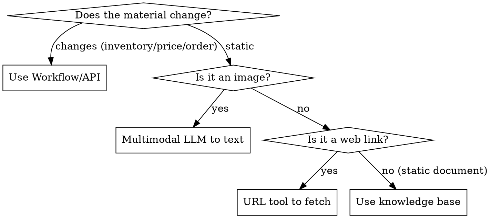

# Material → GPTBots Mechanism Mapping

> The most common mistake when building an agent: using the wrong mechanism for a given material. Use this table first to decide how each material type is connected.

## Mapping table

| Material type | Examples | GPTBots mechanism | How to use |
|---|---|---|---|
| **Static documents / FAQ / policies** | Return policy, company intro, product descriptions | **Knowledge base (knowledge search)** | Ingest documents; the knowledge search node retrieves; the `has-result/no-result` branches distinguish a hit from a miss |
| **Structured data / external systems** | Product database, inventory, orders, prices, CRM | **Workflow / Tool (API)** | Build a Workflow to call the API; attach a tool to the LLM or use a standalone Workflow node; real-time and writable |
| **Web links** | A product page URL the user pastes | **URL tool (e.g. Jina Reader) attached to the LLM** | The LLM sees the link, calls the tool to fetch web content, then answers; read-only |
| **Images** | A product photo/logo/reference image the user sends | **Multimodal LLM** | The multimodal LLM looks at the image → outputs a text description → feeds it downstream (knowledge base/classifier are text retrieval, they don't recognize images) |
| **Fields to remember across turns** | Name, phone, quoted status | **User attributes + variable assignment** | Declare the attribute in settings; write it with a variable-assignment node; read it with `{{attribute_name}}` |
| **Document/file uploads** | A PDF/spreadsheet the user uploads | **Multimodal/file LLM, or extract then feed into the flow** | Use `{{start_msg_document}}`/`{{start_msg_file}}` (array); extract key information as needed |

## Knowledge base landing format (QA vs document)

Before ingestion, confirm which form the platform wants:
- **Q&A**: often needs a fixed template (e.g. a two-column CSV: `Question` / `Answer`); **one question-answer pair = one independent chunk**; phrase questions in varied ways (synonyms/multilingual) to improve recall.
- **Document**: ingest the whole piece; the platform **chunks** it by length/headings; be careful not to cram multiple unrelated items into one chunk.
- Don't ingest volatile data (inventory/prices/orders); route it through Workflow/API.

## Key principles

1. **Knowledge base = text retrieval**. Images and web pages cannot be fed directly — they must first be converted to text
   (image → multimodal LLM, web page → URL tool).
2. **Static → knowledge base, dynamic → Workflow**. Data that changes (inventory/prices/orders) should not be stuffed into the knowledge base; route it through the API.
3. **Convert images to text once at the entry**. Don't re-read the image in every branch; use one multimodal LLM to rewrite
   "user text + image content" into standardized text, and use text everywhere downstream.
4. **Declare anything you need to remember as a user attribute**. The LLM node itself does not remember across turns (it only sees the prompt + memory config);
   store cross-turn data into a user attribute via variable assignment.

## Selection mini-flow

